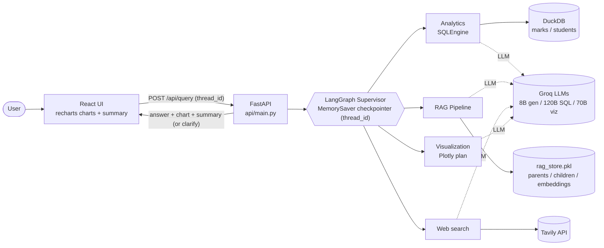
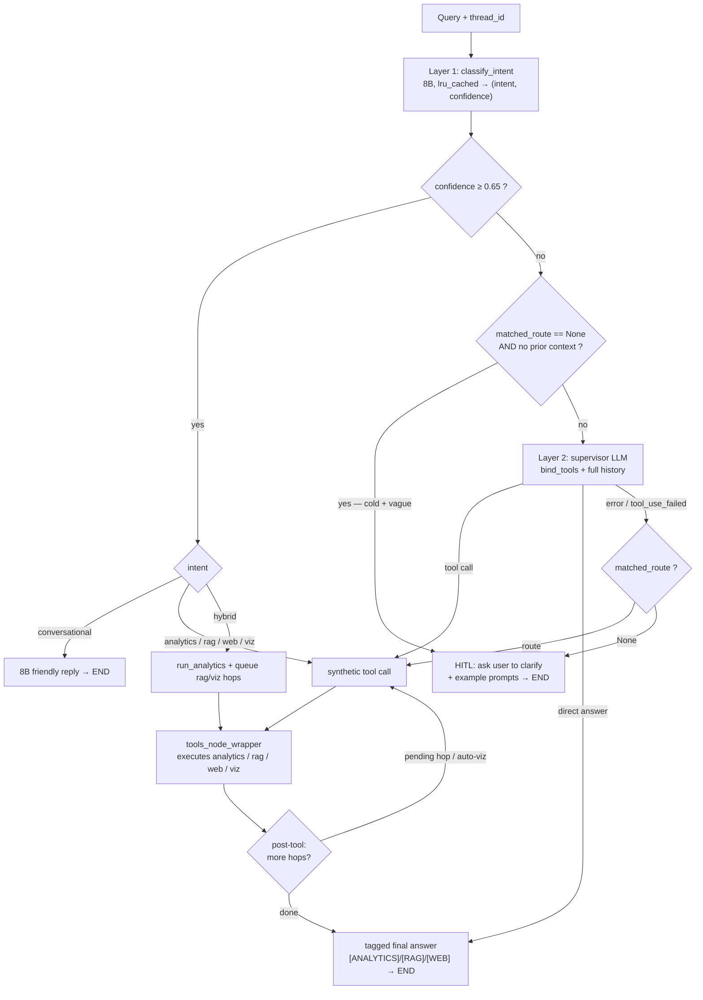
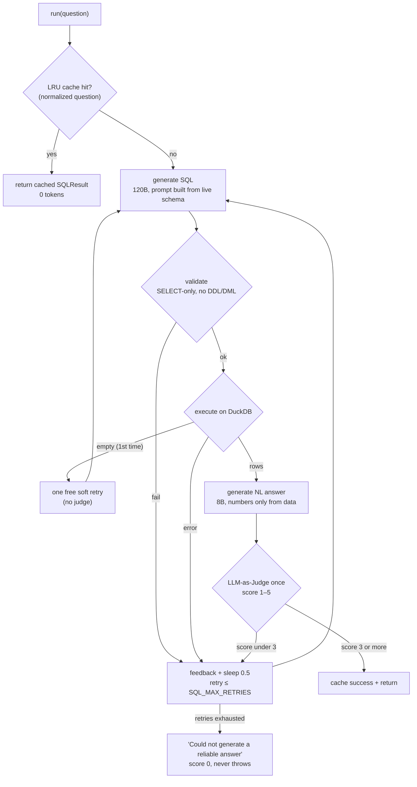
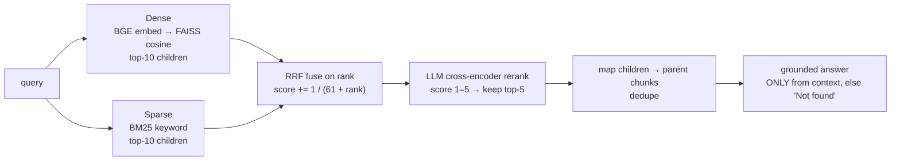
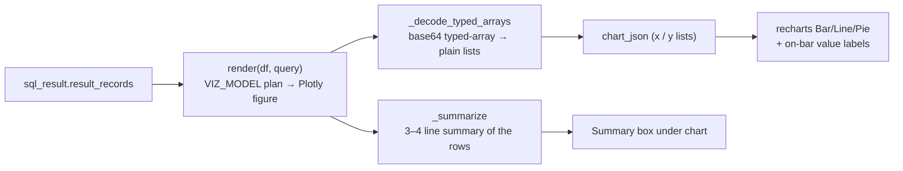

# DMU Analytics Platform v2 — Architecture & Flow Diagrams

> Mermaid diagrams. They render on GitHub and in VS Code (Markdown Preview Mermaid
> extension). To export an image for a slide/interviewer, paste any block into
> <https://mermaid.live>.

---

## 1. System architecture (high level)

---

## 2. The brain — routing, HITL, and the tool loop

This is the one to walk an interviewer through. It shows the **two-layer router**, the
**human-in-the-loop** clarify gate, the crash-proof regex fallback, and the post-tool hop
loop (analytics → rag → viz).

**HITL gate in words:** ask the human **only** when the classifier is unsure **and** the
regex finds no keyword **and** it isn't a follow-up (no prior context). Everything with a
keyword *or* conversation history goes to Layer 2.

---

## 3. SQL analytics — self-correcting loop

---

## 4. RAG — hybrid retrieval pipeline

---

## 5. Chart rendering path (backend → frontend)

> Why `_decode_typed_arrays` exists: Plotly 6 serializes numeric arrays as base64
> typed-array blobs; recharts needs plain lists, otherwise every `y` reads as 0 and the
> bars render blank.

---

*Canonical code lives under `backend/app/`. See `PROJECT_DOCUMENTATION.md` for the full
written deep-dive.*
